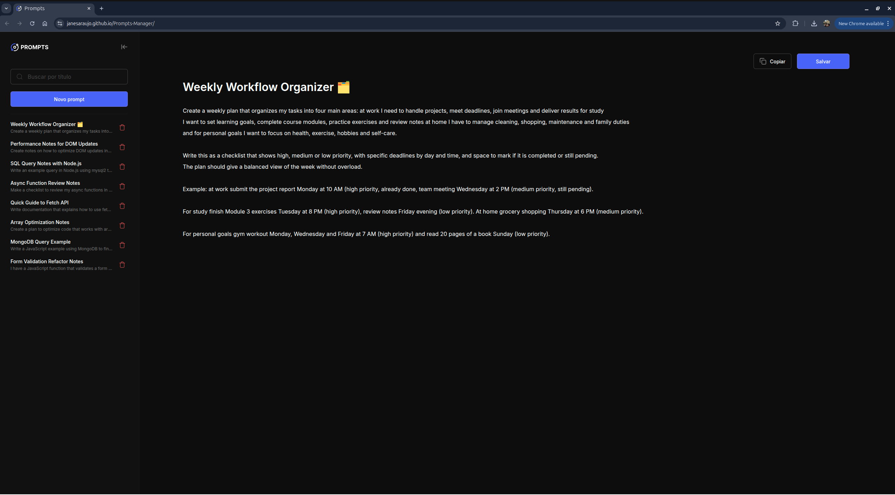
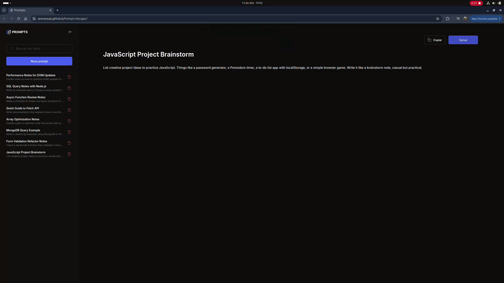

# Prompt Manager

A modern and responsive web application for managing AI prompts. Designed for professionals working with language models who need quick access to organized, searchable, and editable prompts.


## Overview

Prompt Manager offers:

- Centralized organization in a dedicated sidebar (`.sidebar`)
- Instant search by title (`#search-input`)
- Inline editing with `contenteditable` fields (`#prompt-title`, `#prompt-content`)
- Clear buttons to save (`#btn-save`) and copy (`#btn-copy`) prompt content
- Responsive design with collapsible sidebar and Off-Canvas layout on mobile

## Technologies Used

- **Semantic HTML5** (`header`, `aside`, `main`)
- **CSS with custom properties and Flexbox**
- **JavaScript** for interface logic (`script.js`)
- **Media Queries** for full responsiveness

## Design & Development

- Interface inspired by [Rocketseat's Figma design](https://www.figma.com/community/file/1554529095872857492)
- Code accelerated with GitHub Copilot in VSCode
- Integrated with MCP Server for design-to-code translation

## How to Run the Project

Requirements: any modern web browser

```bash
git clone https://github.com/Janesaraujo/Prompts-Manager
cd Prompts-Manager
```

Open the `index.html` file in your browser, or use **Live Server** in VSCode for local development with hot reload.

Live version available at: [janesaraujo.github.io/Prompts-Manager](https://janesaraujo.github.io/Prompts-Manager/)
## Project result




## Contributing

Contributions are welcome! To contribute:

1. Fork this repository
2. Create a new branch: `git checkout -b my-feature`
3. Commit your changes: `git commit -m 'Add new feature'`
4. Push to your branch: `git push origin my-feature`
5. Open a Pull Request
